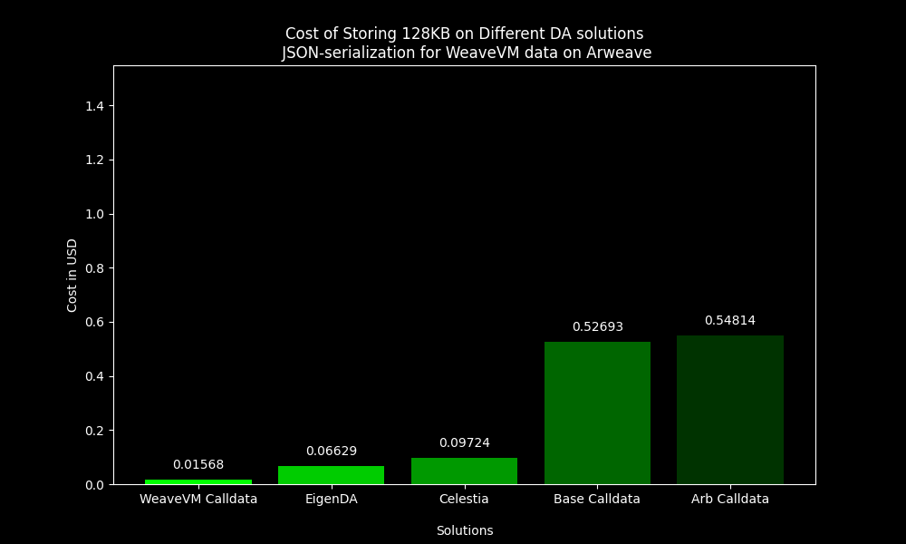

  

## About
This repository hosts the source code for scripts designed to generate informal and data analysis content utilized across WeaveVM platforms.

## Samples

### `impact_gas_limit`

### `json_serialized_da_cost_comparison`

This script provides an outline of the DA costs across various DA solutions. In this case study, we do not account for any data compression or utilize data serialization methods other than JSON for WeaveVM data on Arweave. As a result, the costs are approximately 2x higher than they could potentially be with these optimizations.

### `borsh_vs_json_serialization`
This comparison shows that using [Borsh](https://github.com/near/borsh) serialization results in approximately a 26.6% reduction in data size compared to JSON serialization. This reduction significantly lowers the Arweave fees incurred by WeaveVM for posting data on Arweave.

## License
This repository is licensed under the [MIT License](./LICENSE)