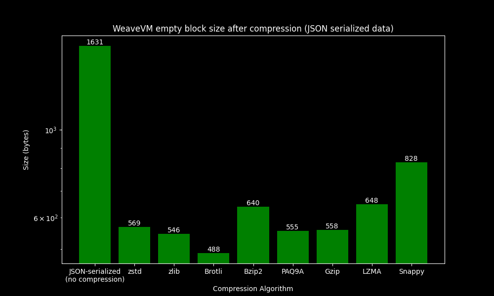

  

## About
This repository hosts the source code for scripts designed to generate informal and data analysis content utilized across WeaveVM platforms.

## Samples

### `impact_gas_limit`

### `json_serialized_da_cost_comparison`

This script provides an outline of the DA costs across various DA solutions. In this case study, we do not account for any data compression or utilize data serialization methods other than JSON for WeaveVM data on Arweave. As a result, the costs are approximately 2x higher than they could potentially be with these optimizations.

### `borsh_serialized_da_cost_comparison`

Here, we have recalculated the DA costs, achieving an approximate 50% reduction in data costs for settling data on Arweave by employing Borsh serialization.

### `borsh_vs_json_serialization`
This comparison shows that using [Borsh](https://github.com/near/borsh) serialization results in approximately a 26.6% reduction in data size compared to JSON serialization (~50% achieved in Rust Borsh). This reduction significantly lowers the Arweave fees incurred by WeaveVM for posting data on Arweave.

### `serialization_compression_benchmark`
In this section, we test various compression algorithms using two data serialization methods (JSON and Borsh) on an [empty WeaveVM block](https://q55zvezq436ucq3tgrbqsve5rkyxgxtzgx4ybohbbjkpi3lyb54q.arweave.net/h3uakzDm_UFDczRDCVSdirFzXnk1-YC44QpU9G14D3k).

### `borsh_gzip_wvm_cost`

### `borsh_brotli_wvm_cost: Testnet V0`

### `borsh_brotli_wvm_cost: Testnet V0.5`

## License
This repository is licensed under the [MIT License](./LICENSE)
